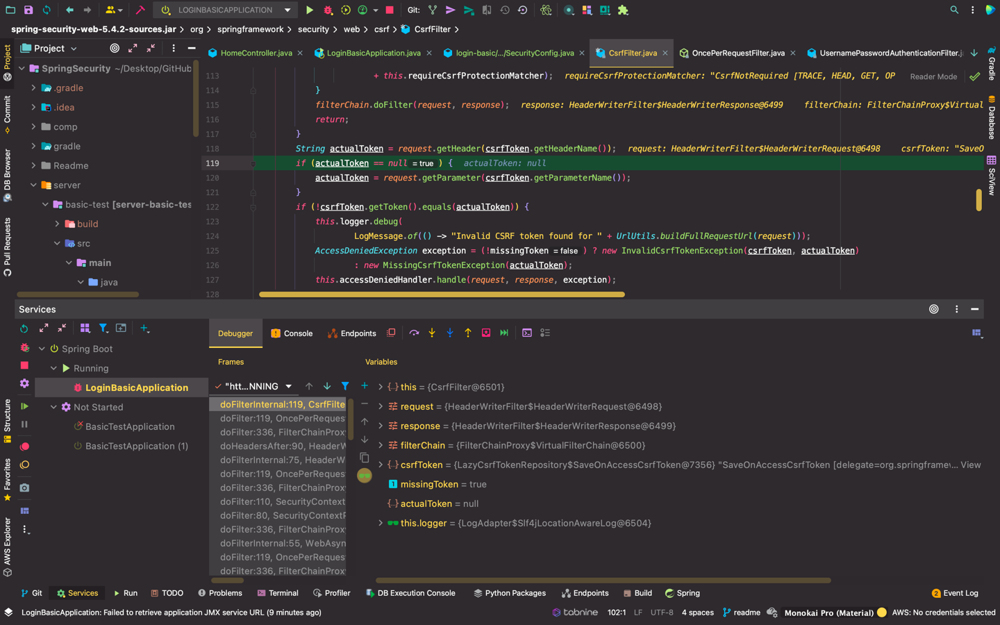

```
http.formLogin(
                login->login.defaultSuccessUrl("/", false)
        );
```

- 왜 alwaysuse option false?

    -> 생각해보면 당연하다. 세션 만로되어서 로그인해야하는 경우를 생각해보면 편-안


```aidl

Security filter chain: [
  WebAsyncManagerIntegrationFilter
  SecurityContextPersistenceFilter
  HeaderWriterFilter
  CsrfFilter
  LogoutFilter
  UsernamePasswordAuthenticationFilter
  DefaultLoginPageGeneratingFilter
  DefaultLogoutPageGeneratingFilter
  RequestCacheAwareFilter
  SecurityContextHolderAwareRequestFilter
  AnonymousAuthenticationFilter
  SessionManagementFilter
  ExceptionTranslationFilter
  FilterSecurityInterceptor
]

```

```aidl
http
      .authorizeRequests(request->{
          request
                  .antMatchers("/").permitAll()
                  .anyRequest().authenticated();
      })
      .formLogin()
      ;
```

- 단순히 formLogin을 적용할 경우 생기는 디버그 목록들! ~> "DefaultLoginPageGeneratingFilter"


~~~
anyRequest() : 설정한 경로 외에 모든 경로를 뜻함
authenticated() : 인증된 사용자만이 접근할 수 있다
permitAll() : 어떤 사용자든지 접근할 수 있다
~~~

- 위의 http 부분을 보게 되면 "/" 외의 경우에는 인가를 받은 경우에만 접근이 가능하다 코드 되어 있다

So,

```
http
    .authorizeRequests(request->{
        request
                .antMatchers("/").permitAll()
                .anyRequest().authenticated();
    })
    .formLogin(
            login->login.loginPage("/login").permitAll()
    )
    ;
```
- 이렇게 적어서 로그인 페이지에 대해서는 누구나 접근이 가능하게

  -> 문제 발생 Scenario ==> 로그인을 해야하는데 로그인이 안된상태면 애초에 인가를 못받은 상황이라 permitAll() 안하면 로그인을 애초에 못하는 상황 발생 ~~> infinite loop



- 단순히 로그인할 때 CsrfFilter 에서 actualToken 이 null으로 할당되는 문제 발견

  -> timeleaf 수정하면 된다

```aidl
@EnableGlobalMethodSecurity(prePostEnabled = true)
```

- 이렇게 되면 설정된 Role 대로 권한을 받아 사용할 수 있다 
